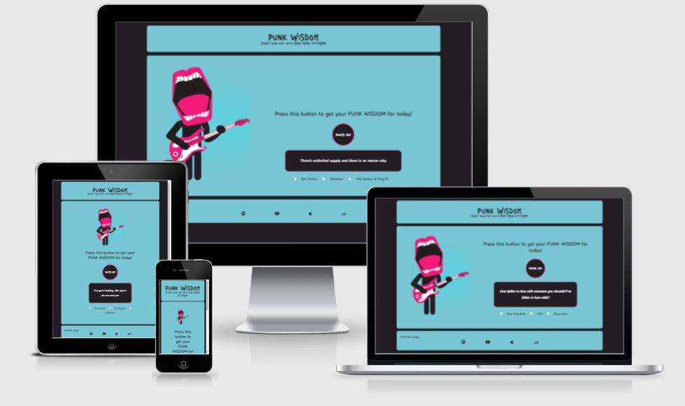
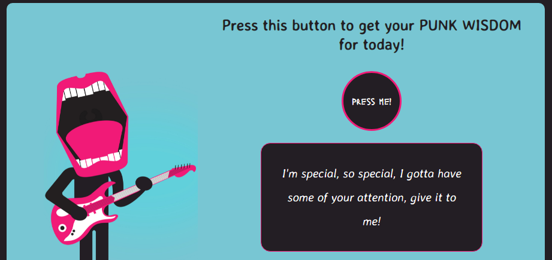
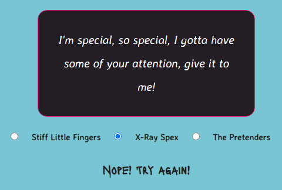
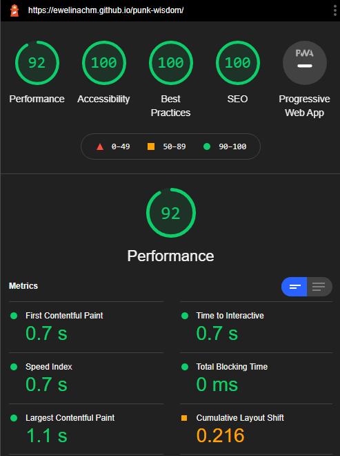

# PUNK WISDOM

PUNK WISDOM is an application that is an affirmation generator and a quiz at the same time. The affirmations need to be taken with a grain of salt because they are all quotes coming from classic punk rock songs. They can be bleak, they can be funny and they can make no sense at all. The name and design of the application, especially the main image suggest that the "wisdom" you'll find here shouldn't be taken too seriously. 

## Features 

PUNK WISDOM is divided into 3 sections: header with the name and a tagline, main area with the image and the play area, footer with icons linked to streaming services. 

- __Header__

  - The name and the tagline of the game are featured at the top of the page with a decorative font corresponding to the punk esthetics but not too distracting and perfectly readable.

- __The main area__

  - This section will allow the user to choose a random "punk wisdom" - an affirmation for the day by simply pressing the button. 

  - The quiz section is where the user will be able to guess the author of the given quote.
  - The user will be able to choose from 3 suggested answers by clicking a radio button and a result will show underneath the options.

- __Footer__

  - This section will allow the user to find the songs on the most popular music streaming services: Spotify, YouTube, Apple Music and Deezer. 

## Testing 

- I tested this application on different browsers: Chrome, Edge, Firefox, Opera.
- I confirmed that all the results are always correct.
- I confirmed that the colors and fonts chosen are easy to read and accessible by running it through Lighthouse in Chrome devtools.

- I confirmed that this project is responsive, looks good and functions on all standard screen sizes using the devtools device toolbar.

### Bugs and problems

- I struggled the most with linking the arrays of options into the HTML input elements. I found the answers in one of the tutorials I found on YouTube and in Stack Overflow.

- My next problem was with clearing the answers when the user clicks the button again. I found a spelling mistake in previously declared variable, which fixed the problem of unticking the radio button. The answer to how to make the text with the result disappear I found in one of the the Love Maths videos.

- During my work on this project I heavily relied on devtools in Chrome for testing and debugging and Stack Overflow for finding answers and fixes to my problems.

### Validator Testing 

- HTML
    - No errors were returned when passing through the official [W3C validator](https://validator.w3.org/nu/?doc=https%3A%2F%2Fewelinachm.github.io%2Fpunk-wisdom%2F)
- CSS
    - No errors or warnings were found when passing through the official [(Jigsaw) validator](https://jigsaw.w3.org/css-validator/validator?uri=https%3A%2F%2Fewelinachm.github.io%2Fpunk-wisdom%2F&profile=css3svg&usermedium=all&warning=1&vextwarning=&lang=en)
- JavaScript
    - No errors were found when passing through the official [Jshint validator](https://jshint.com/)
    - 7 warnings were found initially: 3 times - 'const' is available in ES6 (use 'esversion: 6') or Mozilla JS extensions (use moz). - I changed the constants to variables because there are still a few browsers that do not support constants or 'let'; 4 times - Missing semicolon - all corrected.
    - The following metrics were returned: 
      - There are 4 functions in this file.
      - Function with the largest signature take 1 arguments, while the median is 0.
      - Largest function has 7 statements in it, while the median is 3.
      - The most complex function has a cyclomatic complexity value of 2 while the median is 1.5.

### Unfixed Bugs

No unfixed bugs.

## Deployment

The site was deployed to GitHub pages. The steps to deploy are as follows: 
  - In the GitHub repository, navigate to the Settings tab 
  - From the source section drop-down menu, select the Master Branch
  - Once the master branch has been selected, the page will be automatically refreshed with a detailed ribbon display to indicate the successful deployment. 

The live link can be found here - https://ewelinachm.github.io/punk-wisdom/

## Credits 

- The quotes were taken from some of my favourite song lyrics.
- Instructions on how to correctly link the arrays with answer options to radio buttons I found in this tutorial [YouTube Tutorial](https://www.youtube.com/watch?v=ykszkgydoG4).
- The icons in the footer were taken from [Font Awesome](https://fontawesome.com/).
- The main image was taken from Stockvault [link to the image](https://www.stockvault.net/photo/182953/stylized-singer-playing-electric-guitar).
- The fonts were taken from Google Fonts and I used Archetype [Archetype](https://archetypeapp.com/) to match the fonts for consistent design.
- I generated the favicon using [favicon generator](https://www.favicon.cc/).
